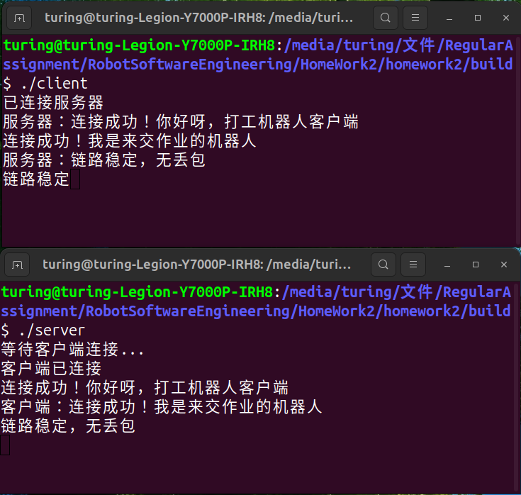

# 基于Socket和多线程编程的双向聊天程序

---
## 一、项目简介

本项目为《机器人软件工程学》第二次作业。采用C++语言实现基于TCP协议的客户端/服务器（C/S）架构聊天系统。通过多线程并发设计，实现消息发送与接收的异步执行，支持服务端与客户端双向实时通信。


## 二、项目结构


```
homework2/

├── server.cpp        # 服务端代码

├── client.cpp        # 客户端代码

├── CMakeLists.txt    # 跨平台构建配置文件

└── README.md         # 项目说明文档
```

## 三、核心实现细节

### 1.多线程设计

服务端与客户端均采用 双线程分离模型，通过C++11`std::thread`实现：


* 接收线程（recv\_msg）：循环监听网络套接字，实时读取对端消息并打印

* 发送线程（send\_msg）：循环监听标准输入，读取键盘输入并发送至对端

#### （1）核心代码片段


```
// 服务端线程创建（server.cpp）
// 创建接收线程，监听客户端消息
thread t1(recv_msg, client_socket);  

// 创建发送线程，处理用户输入
thread t2(send_msg, client_socket);  

// 等待接收线程结束
t1.join();  

// 等待发送线程结束
t2.join();  

// 客户端线程创建（client.cpp）
// 创建接收线程，监听服务端消息
thread t1(recv_msg, sock);  

// 创建发送线程，处理用户输入
thread t2(send_msg, sock);  

// 等待接收线程结束
t1.join();  

// 等待发送线程结束
t2.join();
`

```

### 2.TCP Socket通信流程

#### （1）服务端流程


1. 创建套接字（`socket()`）

2. 绑定端口与 IP（`bind()`）

3. 监听连接请求（`listen()`）

4. 接受客户端连接（`accept()`）

5. 启动双线程处理收发逻辑

6. 关闭套接字（`close()`）

#### （2）客户端流程


1. 创建套接字（`socket()`）

2. 连接服务端（`connect()`）

3. 启动双线程处理收发逻辑

4. 关闭套接字（`close()`）

#### （3）核心代码片段


```
// 服务端 Socket 初始化（server.cpp）
// 创建TCP套接字
int server_fd = socket(AF_INET, SOCK_STREAM, 0);  

// 定义地址结构体
sockaddr_in addr{};  

// 设置为IPv4协议
addr.sin_family = AF_INET;  

// 设置端口9999，转换为网络字节序
addr.sin_port = htons(9999);  

// 监听本机所有IP地址
addr.sin_addr.s_addr = INADDR_ANY;  

// 将套接字与IP、端口绑定
bind(server_fd, (sockaddr *)&addr, sizeof(addr));  

// 开始监听，最大等待队列长度5
listen(server_fd, 5);  

// 阻塞等待客户端连接
int client_socket = accept(server_fd, nullptr, nullptr);  

// 客户端 Socket 初始化（client.cpp）
// 创建客户端TCP套接字
int sock = socket(AF_INET, SOCK_STREAM, 0);  

// 定义服务端地址结构体
sockaddr_in addr{};  

// 设置为IPv4协议
addr.sin_family = AF_INET;  

// 设置服务端端口9999
addr.sin_port = htons(9999);  

// 设置服务端IP为本地回环
inet_pton(AF_INET, "127.0.0.1", &addr.sin_addr);  

// 主动连接服务端
connect(sock, (sockaddr *)&addr, sizeof(addr));  

```

### 3.CMake 构建配置（CMakeLists.txt）


```
# 指定CMake最低版本要求
cmake_minimum_required(VERSION 3.10)

# 定义项目名称
project(ChatSystem)

# 设置C++语言标准为C++11
set(CMAKE_CXX_STANDARD 11)

# 强制要求C++11标准，不满足则编译失败
set(CMAKE_CXX_STANDARD_REQUIRED ON)

# 编译生成服务端可执行文件 server
add_executable(server server.cpp)

# 编译生成客户端可执行文件 client
add_executable(client client.cpp)

# 为服务端链接多线程库
target_link_libraries(server pthread)

# 为客户端链接多线程库
target_link_libraries(client pthread)

```

## 四、编译与运行步骤

### 1.前置依赖


* 操作系统：Ubuntu 24.04（或其他 Linux 发行版）
* cmake:3.28.3
* 编译工具：g++
* 依赖库：pthread

### 2.编译命令


```
//进入作业目录

cd homework2

//创建构建目录（推荐，避免污染源码）

mkdir build && cd build

//生成Makefile

cmake ..

make 
```

### 3.运行步骤


#### （1）启动服务端（终端 1）：


```
cd homework2/build

./server
```

输出提示：`等待客户端连接...`（表示服务端已就绪）


#### （2）启动客户端（终端 2）：


```
cd homework2/build

./client
```

输出提示：`已连接服务器`（表示连接成功）


#### （3）开始聊天：

* 服务端与客户端可互相发送文字消息

* 输入 `exit` 并回车，可关闭当前程序并断开连接


## 五、结果展示

## 六、注意事项


1. 运行时需保证服务端先启动，再启动客户端

2. 端口号固定为 9999，若端口被占用，可修改代码中 `htons(9999)` 为其他未占用端口（如 8888）


